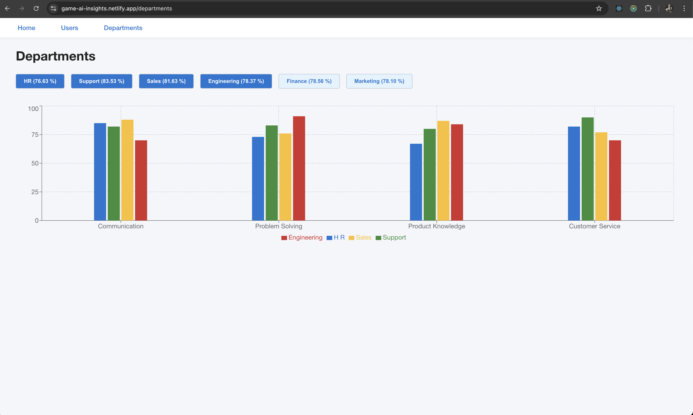

# AI Insights Dashboard

A comprehensive React-based dashboard for analyzing AI-powered customer service insights, featuring performance trends, skill comparisons, and user analytics.

## 📋 Project Overview

AI Insights Dashboard provides data visualization and analytics for customer service performance metrics. The application displays:

- **Performance Trends**: Time-series charts showing department performance over time
- **Department Analytics**: Skill-based comparisons between departments
- **User Leaderboards**: Individual user performance rankings
- **Real-time Insights**: AI-generated summaries of performance data

## 🚀 Setup Instructions

### Prerequisites

- Node.js (v18 or higher)
- npm or yarn package manager

### Step-by-Step Installation

1. **Clone the repository**

   ```bash
   git clone https://github.com/scandindian/ai-insights.git
   cd ai-insights
   ```

2. **Install dependencies**

   ```bash
   npm install
   ```

3. **Set up environment variables**

   ```bash
   cp .env.example .env
   # Edit .env with your API key for Hugging Face API
   ```

4. **Start the backend server**

   ```bash
   # Navigate to server directory
   cd server
   npm install
   npm run dev

   # Make sure your API server is running on the configured port
   # Default: http://localhost:3001
   ```

5. **Start the development server**

   ```bash
   # In a new terminal, navigate back to the root directory
   cd ..
   npm run dev
   ```

6. **Open your browser**
   Navigate to `http://localhost:5173`

**Note**: The application requires a backend API server to be running for data fetching. Make sure your backend is configured and running before starting the frontend development server.

## 📜 Available Scripts

### Frontend Scripts

| Script            | Description                          |
| ----------------- | ------------------------------------ |
| `npm run dev`     | Runs the app in development mode     |
| `npm run build`   | Builds the app for production        |
| `npm run lint`    | Runs ESLint to check code quality    |
| `npm run preview` | Preview the production build locally |

### Backend Scripts (if applicable)

| Script        | Description                           |
| ------------- | ------------------------------------- |
| `npm run dev` | Starts the API server with hot reload |

## 🔧 Development Setup

### Running Both Frontend and Backend

1. **Terminal 1 - Backend Server**:

   ```bash
   cd server
   npm run dev
   # Server running on http://localhost:3001
   ```

2. **Terminal 2 - Frontend Development**:
   ```bash
   npm run dev
   # Frontend running on http://localhost:5173
   ```

## 🎨 Design Decisions

**Architecture**: Built with React 18 and TypeScript for type safety and modern development practices. Used Redux Toolkit for state management to handle complex data flows between components.

**Styling**: Implemented styled-components for component-scoped CSS and responsive design. Chose a clean, professional blue color palette (#1976d2) for consistency across the dashboard.

**Data Visualization**: Created custom chart components (PerformanceTrendChart and DepartmentSkillsBarChart) using `Recharts` for optimal performance and customization rather than heavy third-party libraries.

**Performance**: Utilized `useMemo` hooks to optimize re-renders. Implemented debounced API calls for AI insights to prevent excessive requests.

**Mobile Responsiveness**: Designed mobile-first with CSS Grid and Flexbox, ensuring usability across devices. Components stack vertically on smaller screens while maintaining functionality.

**User Experience**: Added loading states, error boundaries, and empty states throughout the application. Implemented interactive filtering and comparison features for enhanced data exploration.

**Code Organization**: Structured with clear separation of concerns - components, pages, store, and utilities. Used TypeScript interfaces for type safety and better developer experience.

## 📱 Screenshots

### Dashboard Overview


_Main dashboard showing performance trends and key metrics_

### Department Comparison


_Department skill comparison with interactive selection_

### User Analytics


_User leaderboard with skill comparison charts_

### Mobile Responsive


_Mobile-optimized layout for on-the-go access_

## 🚀 Deployment

The application is deployed on Netlify with automatic deployments from the main branch.

**Live Demo**: [https://game-ai-insights.netlify.app/](https://game-ai-insights.netlify.app/)
Backend is hosted with [https://render.com/](https://render.com/)

## 🛠 Tech Stack

- **Frontend**: React 18, TypeScript, styled-components
- **State Management**: Redux Toolkit
- **Charts**: Custom SVG/Canvas components
- **Build Tool**: Vite
- **Deployment**: Netlify and Render
